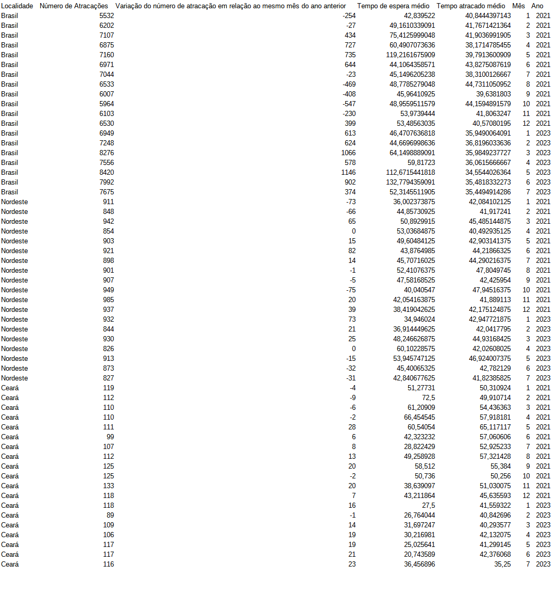

ETL-Antaq
==============================
Respondendo a primeira pergunta
--------

1- Qual o seu nível de domínio nas técnicas/ferramentas listadas abaixo, onde:
• 0, 1, 2 - não tem conhecimento e experiência;
• 3, 4 ,5 - conhece a técnica e tem pouca experiência;
• 6 - domina a técnica e já desenvolveu vários projetos utilizando-a.
Tópicos de Conhecimento:
• Manipulação e tratamento de dados com Python: 6 \n
• Manipulação e tratamento de dados com Pyspark: 6 \n
• Desenvolvimento de data workflows em Ambiente Azure com databricks: 5 \n
• Desenvolvimento de data workflows com Airflow: 5 \n
• Manipulação de bases de dados NoSQL: 6 \n
• Web crawling e web scraping para mineração de dados: 6 \n
• Construção de APIs: REST, SOAP e Microservices:  5 \n

--------

--------
Respondendo a segunda,
2 - 
Para as tabelas, minha orientação seria armazená-las em uma estrutura de banco de dados SQL no Data Lake. Isso se deve à natureza altamente estruturada e relacionada dessas tabelas, que contêm informações detalhadas sobre atracações de embarcações e movimentações de cargas em portos.

Essas tabelas envolvem dados como datas, localidades, tipos de operação, quantidades, pesos e outras métricas de desempenho, que são mais adequadas para armazenamento e consulta em um ambiente SQL. Consultas complexas, agregações e junções entre essas tabelas podem ser necessárias para análises de desempenho, tendências e relatórios detalhados.

Além disso, a estrutura de banco de dados SQL oferece a capacidade de garantir a integridade referencial entre as tabelas, o que é importante quando há relacionamentos complexos entre os dados, como no caso das atracações e suas cargas associadas.

Em resumo, para as tabelas , a escolha de um banco de dados SQL proporcionaria eficiência na consulta e na análise de dados estruturados e relacionados, atendendo aos requisitos de armazenamento e consulta no Data Lake de forma adequada.

--------

Projeto:

Aqui o fluxo de organizaão do projeto a ser desenvolvido.
Para rodar todo o fluxo do código. Rode ` python src/ ` em seu terminal.

Organização do Projeto
------------

    ├── LICENSE
    ├── Makefile           <- Makefile com alguns comandos, somente para exemplificar uma esteira de CD do ETL. 
    ├── README.md          <- Documentação do projeto
    │
    │
    ├── requirements.txt   <- Requerimentos para pip
    │                         
    │
    ├── src                <- Listado os códigos do ETL
    │   ├── __init__.py    <- Arquivo __init__.py
    │   │
    │   ├── extractors        
    │   │   └── make_dataset.py <- Código para extrair dados da Antaq
    │   │
    │   ├── loaders       <- Códigos para carregar dados no DataLake e banco de dados 
    │   │   └── antaq_to_lake.py
    │   │   └── antaq_to_sql.py
    │   │
    │   ├── transform     
    │   │   └──  etl_antaq.py    <- Código para transformação dos dados   
    │   │    
    │   │── main.py <- Código que roda todo o fluxo ---> Rode python src/ para executá-lo
    │   │
    │   └── results  
    │   |    └── consulta_sql.py <- Código que faz a consulta SQL no SQL SERVER via Spark e retorna os dados em formato de Excel.
    |   |
    |   └── querys <- Traz os códigos de consultas sqls utilizados.
    |         └── creation_atracacao_fato.sql <- Retorna a criação da tabela atracaco_fato
    |         └── creation_carga_fato.sql <- Retorna a criação da tabela carga_fato
    |         └── select_resultado_antaq.sql <- Retorna a criação da tabela com os resultados requeridos pelos economistas
    |         └── select_view_antaq.sql <- Criação de view para query sql Spark
    |         └── select_resultado_antaq.sql <- Criação de resultado para query sql Spark, gera também os resultados requeridos pelos economistas.
    |
    │── documentation <- Traz documentação sobre colunas das tabelas, metadados. 
    |   
    |── airflow <- Traz as dags, e arquivos de deploy de Docker para Airflow. 
    |
    |
    |
    └── antaq_data <- Traz extrações do site da Antaq de 2023 até 2021, também tem um histórico de 2020, como um adicional.

--------
Aqui o resultado final em imagem, também está disponibilizado em Excel no arquivo ReportAntaq.xlsx na pasta Antaq_report

Também disponibilizei um desenho de arquitetura da solução na Azure, utilizando airflow. 

